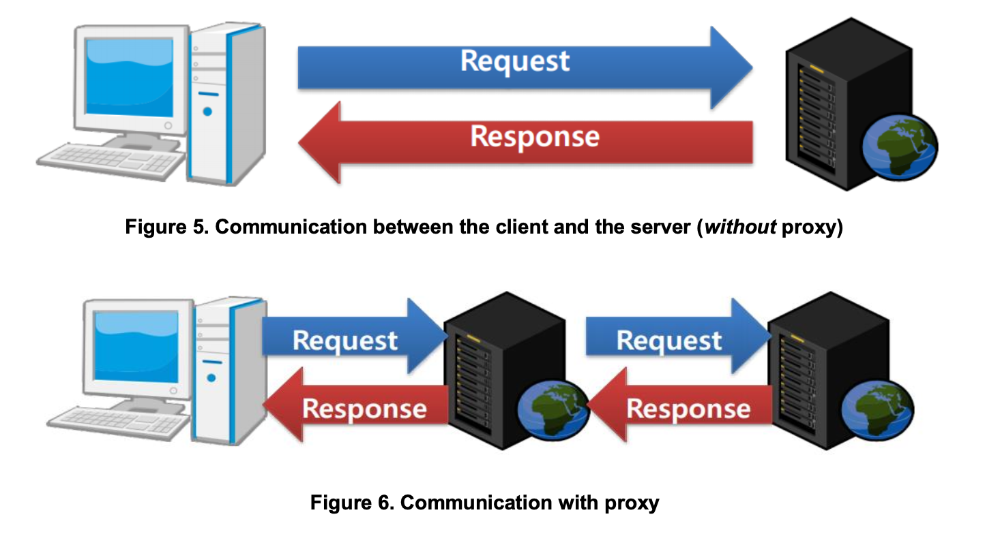
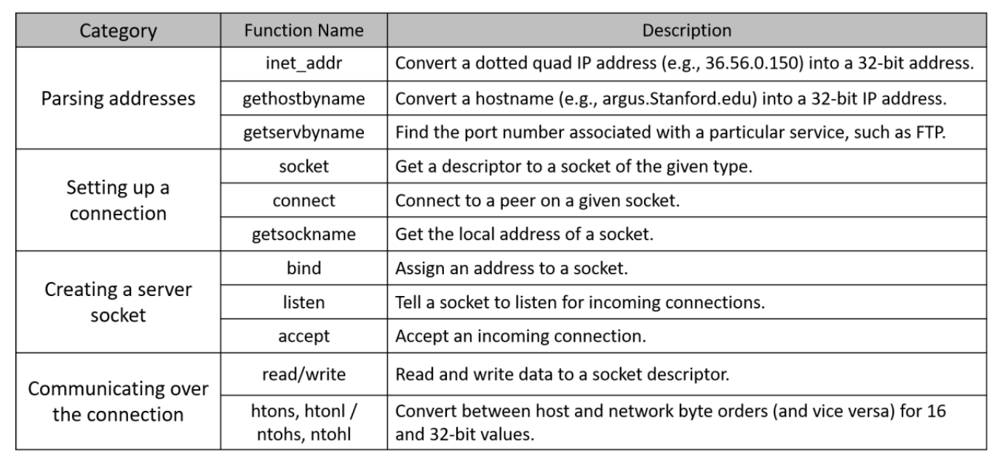

# CSE351-assignment-2
CSE351: Computer Networks | Fall 2025 | HTTP Web Proxy with Caching


A multiclient HTTP/1.0 web proxy written in C that accepts requests from web clients, forwards them to remote servers, returns responses to clients, and supports HTTP caching.

The proxy acts as an intermediary between clients and web servers, handling request validation, URL parsing, server communication, response forwarding, and cache management.

## Proxy Architecture

The proxy acts as an intermediary between clients and remote web servers. Instead of communicating directly with the destination server, clients send requests to the proxy, which forwards the requests and returns the responses.



## Features

* HTTP/1.0 proxy server
* Request validation and error handling
* URL parsing and host resolution
* Communication with remote web servers
* Response forwarding to clients
* Multiple client support
* Browser compatibility (Firefox)
* HTTP caching support
* Build automation using Makefile

## Repository Structure

```text
.
├── CSE351_PA2.pdf     # Assignment specification
├── Makefile           # Build configuration
├── README.md          # Repository documentation
├── proxy.c            # HTTP proxy implementation
└── report.pdf         # Implementation report
```

## Socket Programming Functions

The implementation relies on the Berkeley Sockets API for network communication. The following reference table summarizes the main socket-related functions used throughout the project.



## Building

Compile the project with:

```bash
make
```

This generates the executable:

```text
proxy
```

## Running

Start the proxy server on a specified port:

```bash
./proxy 5678
```

The proxy will listen for incoming client connections on the provided port.

## Supported Functionality

### Request Handling

The proxy:

* Accepts HTTP requests from clients
* Validates request format
* Parses request headers
* Extracts host, port, and path information
* Forwards valid requests to remote servers
* Returns responses back to clients

### Supported Requests

The proxy supports:

* HTTP method: `GET`
* HTTP version: `HTTP/1.0`

### Error Handling

The proxy returns:

```text
400 Bad Request
```

for invalid requests, including:

* Missing `Host` header
* Unsupported HTTP methods
* Unsupported HTTP versions
* Invalid hostnames

## Proxy Workflow

1. Client connects to the proxy.
2. Proxy receives and validates the HTTP request.
3. Proxy extracts host, port, and path information.
4. Proxy connects to the destination web server.
5. Proxy forwards the request.
6. Remote server returns a response.
7. Proxy sends the response back to the client.
8. Connection is closed after the transaction completes.

## Multiple Client Support

The proxy supports multiple simultaneous client connections.

Incoming requests are handled concurrently so that one client does not block other active connections.

## HTTP Caching

The proxy supports caching of HTTP responses.

Cache decisions are based on response headers such as:

* `Cache-Control`
* `Expires`
* `Pragma`

Supported Cache-Control directives:

### max-age

```text
Cache-Control: max-age=<seconds>
```

* Response is stored in cache.
* Cached content remains valid for the specified duration.
* Requests for the same resource during this period are served from cache.

### public

```text
Cache-Control: public
```

* Response may be stored by the proxy cache.

### private

```text
Cache-Control: private
```

* Response is not stored in the shared proxy cache.

Expired cached entries are refreshed by requesting a new response from the origin server.

## Browser Compatibility

The proxy is compatible with web browsers configured to use an HTTP/1.0 proxy.

For Firefox:

1. Open Settings.
2. Navigate to Network Settings.
3. Select Manual Proxy Configuration.
4. Enter the proxy host and port.
5. Set:

```text
network.http.proxy.version = 1.0
```

in `about:config`.

## Testing

Example request using Telnet:

```bash
telnet localhost 5678
```

Example HTTP request:

```http
GET / HTTP/1.0
Host: www.example.com
```

A successful request returns the HTTP response from the destination server through the proxy.

## Source Files

### proxy.c

Implements:

* Socket setup and listening
* Client connection handling
* HTTP request validation
* URL parsing
* Remote server communication
* Response forwarding
* Cache management
* Concurrent client support
